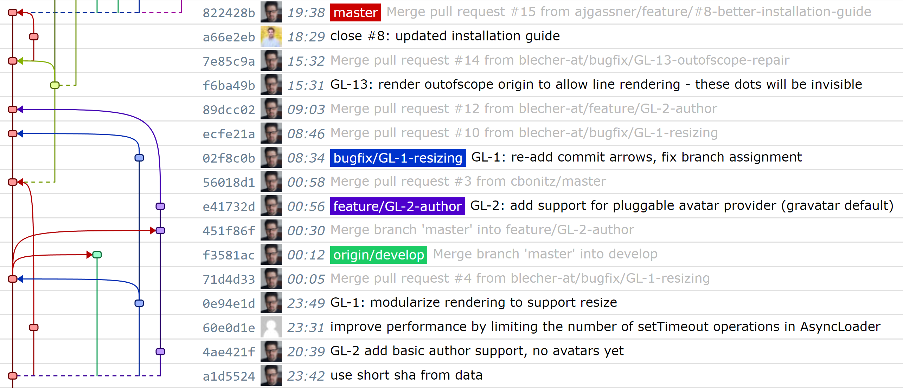

# gitline - A git history to HTML renderer implemented in TypeScript


> [!NOTE]
> This is a fork of the original project by [blecher-at](https://github.com/blecher-at/gitline). This fork updates the project to a more modern approach and removes a lot of libraries that are no longer needed.

The idea is to have this on a central server or your local machine, to keep tabs on what your team is doing :)
Needs a JSON file as input (generated with [git2json](https://github.com/blecher-at/git2json))

gitline tries to be aware of your branching scheme. It will autodetect the category and assignment of branches and groups commits accordingly.

## Usage

[](https://nodei.co/npm/@piotrpdev/gitline/)

[An NPM package is available for this project](https://www.npmjs.com/package/@piotrpdev/gitline). You can see typical usage in [`src/demo/`](src/demo/).

It usually looks something like this:

```html
<!DOCTYPE html>
<html>
  <head>
    <meta charset="utf-8" />
    <title>Gitline Example</title>

    <!-- jQuery required by JSGL -->
    <script src="https://cdn.jsdelivr.net/npm/jquery@3.7.1/dist/jquery.min.js"></script>
    <!-- JSGL used for generating pretty SVG Git lines -->
    <script src="https://cdn.jsdelivr.net/gh/jsgl/repo@6231386/jsgl.min.js"></script>
    <!-- Optional styles to make stuff look nice -->
    <link rel="stylesheet" href="https://cdn.jsdelivr.net/npm/@piotrpdev/gitline@1.0.4/dist/gitline.min.css"/>
    <!-- This library -->
    <script src="https://cdn.jsdelivr.net/npm/@piotrpdev/gitline@1.0.4/dist/gitline.umd.min.js"></script>
  </head>
  <body>
    <div id="myGitlinePanel-1"></div>

    <script>
      Gitline.create()
        .fromJSON(`assets/data/example02.json`)
        .withHeader("<h1>My Gitline</h1>")
        .renderTo(document.querySelector("#myGitlinePanel-1"));
    </script>
  </body>
</html>
```

## Creating sample data

- Install [git2json](https://github.com/blecher-at/git2json)
- run `git json > myfile.json` - in a cronjob/github workflow presumably
- point `src/demo/index.html` to the newly created JSON file

## Imports / Third party

- Programming language: [TypeScript](http://www.typescriptlang.org/)
- SVG Rendering: [JSGL](https://github.com/jsgl/repo)  
  - Uses [jQuery](https://jquery.org/)
- Hash Generation: [Crypto JS](https://github.com/brix/crypto-js)

## Development

- Install Node.js
- Install dependencies: `npm install`
- Build the library: `npm run build`
- View the examples: `npm run dev:demo`
- Test the library: `npm run test`

## Legal / License

Licensed under the [Affero GPLv3](LICENSE), which basically says: You are free to hack and use,
but if you want to build a product out of it, or host it as a service, we need to talk.
